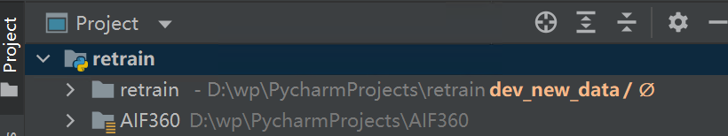
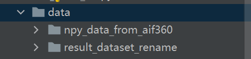
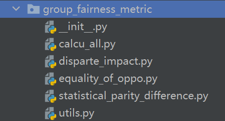
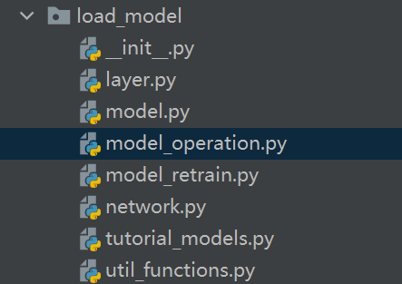
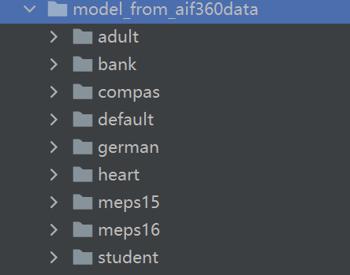
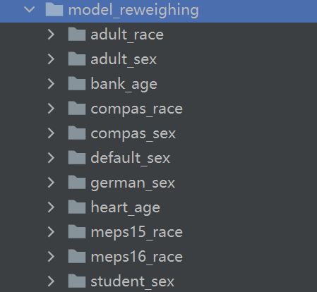
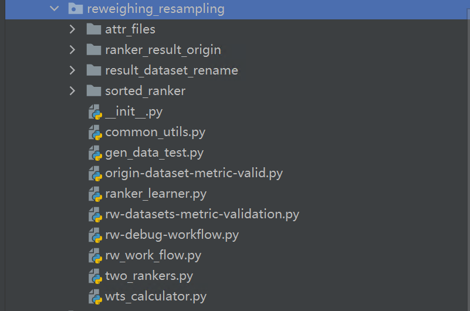
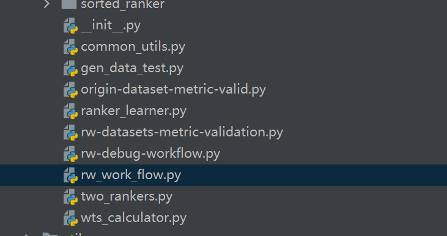

# Reweighing代码说明

## 基本环境

主要软件版本 python3.7 tensorflow1.15

其他的软件可以按照pycharm的推荐直接安装至conda当前激活环境的解释器

重要：请将[AIF360](https://github.com/wangpei72/AIF360.git)(注意：最新的、需要的代码在dev_new_data分支上，克隆之后务必切换至该分支)的文件夹，放在该仓库的所在路径下，并在pycharm中将AIF360配置成为re-weighing文件夹的source文件夹

最后整个工程的结构应该看起来是这样的

## 代码各模块说明

data文件夹下是数据集，npy_data_*文件下是原始的预处理过后的npy数据集文件，result_dataset文件夹下是各个数据集选取某个敏感属性后应用 PS（权重调整之优先抽样）算法后的到的去偏后数据集（改变了样本分布，得到的数据集本身进行spd， di的测算值非常接近于0和1）

该文件夹下是部分公平性指标的实现，是四月份时使用的版本，现阶段已经不需要了，我们可以直接通过AIF360 的datasetmetric类调用各类指标的计算函数。

该文件夹下时加载模型的python文件，主要使用model_operation.py,我在main函数中加了循环，可以一次性进行所有数据集模型的训练。

该文件夹下是原始的模型文件

model_reweighing文件夹下是经过权重调整之后的数据集进行训练得到的模型。

这是主要的算法实现文件夹，其中子文件夹的介绍如下：

attr_files:该文件夹定义了有关每个数据集的敏感属性，y语义等meta信息，

ranker_result_origin:该文件夹下存储了所有数据集在原始的model上进行预测后的得分（softmax层后的输出，是一个包含一组2维数据的npy文件，组的长度为数据集训练集大小），参考的论文称之为ranker

result_dataset_rename:该文件夹存储经过权重调整的优先重采样算法 之后 得到的目标数据集，每个子文件夹下包含x_generated.npy 与y_generated.npy分别是特征和标签文件

sorted_ranker：存储经过排序之后的ranker，根据论文的描述进行排序，之后进行重采样需要对数据集案例进行重复或者删除，具体优先删除或者重复哪些样例，则是根据排序后的ranker来进行优先级判断的。

其他未说明的文件夹则是由ADF给的原始文件继承来的，基本没有变动。一些不相干的文件夹已经被删除以节省空间，一些被保留因为可能在部分代码里用到了，虽然用处和主要的算法无关，只是为了不看到pycharm爆红而保留。

## 代码运行

请找到rw_work_flow.py,找到main函数，点击run运行该脚本。该脚本集成了算法所有的步骤，并且如果已经运行了一遍该脚本且成功执行完毕的情况下，可以注释142行，解注143行函数，这样运行的脚本将跳过生成ranker的步骤，直接使用之前生成的ranker文件。

脚本的运行结果是获得经过权重调整算法-优先重采样之后的数据集，该数据集存储在之前提到的result_dataset_rename文件夹下。

预处理阶段到此结束，按照算法思想，之后应该将权重调整得到的数据集对模型进行重新训练，从而得到重训练的模型。这些模型我们使用model_operation.py脚本已经获得了，存储在model_reweighing文件夹下。

